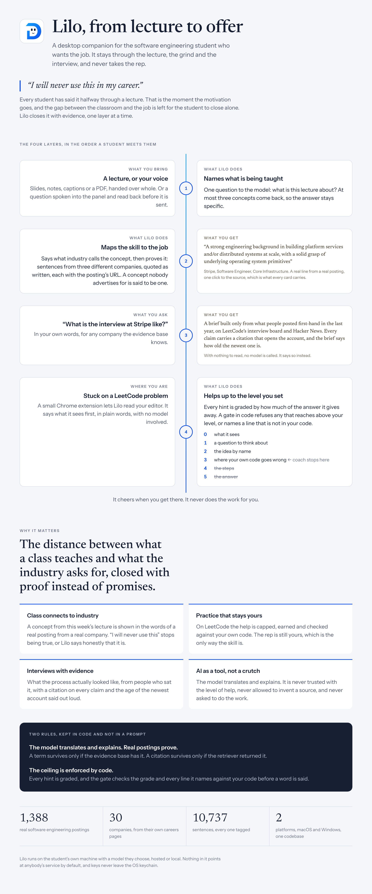
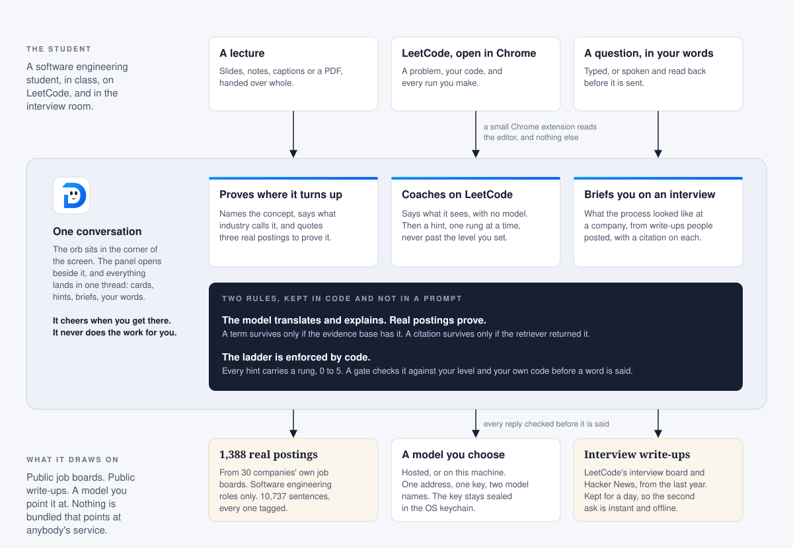

# Lilo

**A desktop companion for the software engineering student who wants the job.**

> **"I will never use this in my career."**

Every student has said it, halfway through a lecture. That is the moment the
motivation goes: the slides keep moving, the concept stays abstract, and the
job it was all supposed to lead to feels further away, not closer. The gap
between the classroom and that job is real, and the student is left to close
it alone.

Lilo is a companion that stays with the student through all of it, from that
lecture to the LeetCode grind to the interview to the offer.

- **Hand it a lecture.** It names the concept, says what industry calls the
  same thing, and quotes a real job posting to prove it, with the URL behind
  the quote.
- **Open a problem on LeetCode.** It sits beside you, reads your editor, and
  helps only up to a ceiling you set, so the effort stays yours.
- **Ask about an interview.** It reads what people posted first-hand about a
  company, with a citation on every claim.

It cheers when you get there. It never does the work for you. It runs on
macOS and Windows from one codebase.

> [!IMPORTANT]
> **Built for the LILO Summer Academy Hackathon, September 2026.**
> Track 01, LILO Behind the Scenes: DSA practice and interviewing.

## Why it matters

Closing that gap is what this hackathon is named for, and an AI is the obvious
tool: it can read the lecture and it can read the postings. The two ways it
goes wrong are well known. It invents the link, and the student believes it.
Or it does the work, and the student learns nothing.

Lilo is shaped around refusing both, and the refusals are in code, not in a
prompt.

- **The model translates and explains. Real postings prove.** Every claim
  about industry traces to a sentence with a posting URL. A term the model
  returns survives only if the evidence base has it, and a citation survives
  only if the retriever returned it. A concept nobody advertises for is said
  to be one, which is a truer answer than a stretched term.
- **The ladder is enforced by code.** Every LeetCode hint carries a rung, 0 to
  5, by how much of the answer it gives away. The tier the student picks is a
  ceiling on that ladder, and a gate checks the rung, every line number and
  every name against the student's own code before a word is said. The model
  is told the ceiling and never trusted with it.

## The journey

The four layers in the order a student meets them, then why it matters.



## How it is built

A picture first, then the same thing in words.



When Lilo is running, three things are on your machine.

- **Lilo itself**, an Electron app. It is the orb in the corner, the panel
  beside it, and a main process behind them that does all the thinking. Only
  the main process can reach the disk, the network or your keys. The panel is
  a sandboxed web page that can ask it for things, and nothing more.
- **A Chrome extension**, three small files you load once. It reads the code
  in your LeetCode editor and tells Lilo what changed. It never reads any
  other site, and it never writes to the page, except to mark a line a hint
  points at.
- **A small helper that Chrome starts**, so the extension has a way to reach
  the app. It is Lilo's own program, started by Chrome as plain Node with no
  window.

Beside them, on disk, sits **the evidence base**: 1,388 real software
engineering postings from 30 companies, broken into 10,737 sentences, each
tagged with the tools and practices it mentions. It is one file, rebuilt by
one command, and Lilo reads it when it starts.

And somewhere you choose, **a model**. Hosted, or on your own machine. Lilo
never picks one for you.

### When you hand it a lecture

1. The file is read whole, and the model is asked one thing: what is being
   taught here? At most three concepts come back.
2. For each concept, Lilo looks in the evidence base for the terms postings
   use nearest to it, and hands that shortlist to the model with one
   instruction: copy one exactly.
3. Anything the model says that is not in the evidence base is thrown away.
   The one exception is a term the quoted postings themselves use, word for
   word. If nothing survives, Lilo says postings do not ask for this, rather
   than stretching.
4. What survives becomes a card: sentences from three different companies,
   quoted as written, each with the URL of the posting it came from.
5. At the end of a session, a recap: what you met, and what postings for your
   track ask for that you have not.

### When you are stuck on LeetCode

1. The extension reports the problem, your code, and every run with its
   verdict. Every report is checked against a fixed shape before anything
   reads it.
2. Lilo says what it sees first, in plain words, with no model involved: the
   problem, how many lines you have, what the last run said.
3. A hint it offers on its own is earned: one rung higher at a time, no more
   than once a minute, and only after your code has changed. Ask, and it
   answers at the level you set.
4. The model is asked once, for a hint that carries a rung from 0 to 5. A gate
   then reads the hint, decides which rung it really reaches, and refuses it
   if that is above your level, or if it names a line or a variable that is
   not in your code.
5. A refused hint is asked for once more under a stricter instruction, then
   dropped. Only then is a word said, and any line it names is marked in your
   editor.
6. Ask to be walked through it, and the hint comes with a dry run: the
   pointers on the array, the values that change, one row per step, drawn in
   the thread for you to step through at your own pace. The same ceiling
   applies to the picture as to the words.

### When you ask about a company's interview

1. Lilo fetches what people posted first-hand in the last year, on LeetCode's
   interview board and on Hacker News. Nothing else is read. With nothing to
   read, no model is called, and it says so.
2. The accounts are split into numbered sentences, and the model is given
   those and nothing else.
3. Every claim in the reply has to point at one of those sentences. A claim
   that does not is dropped where it stands. How old the newest account is
   comes from the dates, not from the model.

Two things hold on every one of these paths. Every model call waits in one
queue, and every structured reply is checked against a schema before it is
believed. And nothing you ask for is dropped because the app is busy.

[docs/architecture.md](docs/architecture.md) has the reasoning behind each of
these choices, and the tree below maps them to the code.

### Where things are

```
lilo-companion
├── main/              the Electron main process
│   ├── session.ts     the loop: hear, see, lock in, recap
│   ├── pipeline/      lecture to concept to posting terms to evidence
│   ├── ikb/           the evidence base: tagging, search, roles, gaps
│   ├── chat/          the companion's answers, and the citation filter
│   ├── leetcode/      the practice: state, ladder, coach, bridge, recordings
│   ├── interviews/    first-hand accounts: ask, sources, brief, cache
│   ├── llm/           one queue, one schema check, a provider per protocol
│   ├── panel.ts       the window
│   ├── tray.ts        the menu bar mark
│   ├── settings.ts    settings over .env, keys sealed in the keychain
│   ├── voice.ts       speech to words
│   ├── guards.ts      nothing from a renderer reaches a window unchecked
│   └── host.ts        the native messaging host Chrome runs
├── preload/           the one door between main and a renderer
├── renderer/          React, sandboxed, no Node in it
│   ├── bubble/        the orb and its face
│   ├── thread/        the panel: one conversation
│   └── settings/      the preferences window
├── shared/            types, prompts, schemas, layout maths
├── extension/         the Chrome extension: agent, relay, service worker
├── data/              the evidence base, and the lists that build it
├── scripts/           the ingest that rebuilds it
└── docs/              the reasoning
```

## Running it

```bash
npm install
node node_modules/electron/install.js
npm run dev
```

Node 22.18 or newer. The second line fetches the Electron binary, because
npm 11 skips install scripts. The same three lines work in PowerShell and cmd.

An orb appears bottom right, and a mark in the menu bar on macOS or the
notification area on Windows. There is no Dock tile or taskbar button.
Cmd+Shift+Y on macOS and Ctrl+Shift+Y on Windows open and close the panel.
Escape closes it. Nothing has to be configured before the app starts.

## A model

Open the panel and press the gear. A model is an address, a key and two model
names, and you type all three. How the endpoint speaks is decided from the
address: api.anthropic.com gets the messages API, and everything else gets the
OpenAI chat API, which is what every hosted service, gateway and local server
speaks. The model list is read from the endpoint, and "Test it" makes one real
call and says what came back.

Keys are sealed with the OS keychain, Keychain on macOS and DPAPI on Windows,
and never reach the renderer, which learns only whether a key is set and its
last four characters. Anything left blank falls through to `.env`, so a
developer checkout needs no clicking.

To run with no network at all, pull a model into Ollama and give Lilo the
address. A local address is recognised and asks for no key.

```bash
ollama pull qwen2.5-coder:7b
```

```
LLM_BASE_URL=http://localhost:11434
MODEL_FAST=qwen2.5-coder:7b
MODEL_STRONG=qwen2.5-coder:7b
```

The quick model reads lectures and answers questions. The careful one coaches
on LeetCode.

## LeetCode

Settings, the LeetCode tab, "Set up Chrome". It writes the file Chrome needs.
Then open chrome://extensions, turn on Developer mode, press Load unpacked and
pick the folder the tab shows. The tab says Connected once a problem is open.

| Tier | Volunteers up to | Answers up to |
|---|---|---|
| Hands off | what it sees | a question to think about |
| Coach | the idea by name | where your own code goes wrong |
| Tutor | the steps | the answer, and only when asked outright |

A hint that names lines marks them in the editor, as the companion's, and
clears them on your next edit. Nothing else is ever written to the page.

Every session is written to a file under the app's data folder, one event per
line. `--work-recording path/to/session.jsonl` plays one back with no browser
open, which is how the companion's manners are tuned.

## Lectures, voice and interviews

A lecture is a `.txt`, `.md`, `.vtt`, `.pdf` or `.pptx`. Drag it onto the orb
or the panel, pick it from the menu bar mark, or paste notes into the composer.
`--lecture path` or `LECTURE_FILE=` in `.env` starts with one already read.

Voice mode is the mic beside "Upload a lecture". Cmd+Shift+M on macOS and
Ctrl+Shift+M on Windows records, and the words land in the composer to be
read before they are sent. Speech goes where the model is when that address
transcribes, as OpenAI's and Groq's do. A whisper server on this machine keeps
it here:

```
VOICE_BASE_URL=http://localhost:8000
VOICE_MODEL=Systran/faster-whisper-small.en
```

An interview brief is a question in your own words: "I have an onsite with
Coinbase". What was read is kept for a day, so the second ask is instant and
offline. Glassdoor, Blind and Reddit are not read: they want a login or refuse
the request.

## The evidence base

`data/ikb.json` ships built from the 30 boards in `data/boards.json`, the same
endpoints the companies' own careers pages call. No auth, no scraping. A
posting is kept only if its title is a software engineering role; sales,
product and design are dropped at ingest. Add a company by adding a row.

```bash
npm run ingest
```

## Checks

| | |
|---|---|
| `npm test` | 288 tests: tagging, search, gaps, citations, the ladder, the bridge, the tray mark, and the whole loop against a scripted model |
| `npm run typecheck` | main, preload, renderer and the tests |
| `npm run build` | the three bundles under `out/` |
| `npm run package:mac`, `npm run package:win` | installers, which CI also builds on both platforms |

`LILO_DEBUG_LLM=1` prints every model call with its queue wait and its wire
time. `LILO_OPEN_PREFS=1` opens the preferences window on launch.

## Both platforms

One codebase. What differs sits behind `process.platform`: how a floating
window takes focus, how the menu bar mark is drawn, where keys and the Chrome
host manifest live. [docs/platforms.md](docs/platforms.md) says exactly where,
and which of those a Mac cannot verify.

## Read next

| | |
|---|---|
| [docs/architecture.md](docs/architecture.md) | why each part is shaped the way it is, and where the time goes |
| [docs/platforms.md](docs/platforms.md) | macOS against Windows, and which differences are load-bearing |
| [docs/character.md](docs/character.md) | the orb: its geometry, its moods and the menu bar mark |
| [docs/demo-script.md](docs/demo-script.md) | the three minute demo, beat by beat |
| [AGENTS.md](AGENTS.md) | the working agreement for anyone changing the code, person or agent |

## License

Apache 2.0. See [LICENSE](LICENSE).
