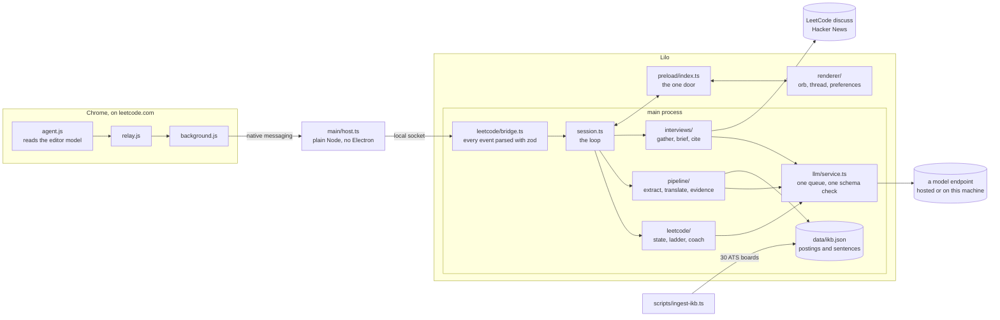

# Lilo

A desktop companion for the software engineering student who wants the job.

Every student has sat in a lecture and thought "I will never use this." That
is the moment the motivation goes: the slides keep moving, the concept stays
abstract, and the job it was all supposed to lead to feels further away, not
closer. Lilo is a companion that stays with the student through all of it,
from that lecture to the LeetCode grind to the interview to the offer.

Hand it a lecture and it names the concept, says what industry calls the same
thing, and quotes a real job posting to prove it, with the URL behind the
quote. Open a problem on LeetCode and it sits beside you, reads your editor,
and helps only up to a ceiling you set, so the effort stays yours. Ask what an
interview at a company is like and it reads what people posted first-hand,
with a citation on every claim. It cheers when you get there. It does not do
the work for you.

It runs on macOS and Windows from one codebase. Built for the LILO Summer
Academy Hackathon, Track 01: DSA practice and interviewing.

## Why it matters

The distance between a lecture and a job posting is the gap this hackathon is
named for, and a student cannot close it alone: nobody in class says which of
this week's ideas a Stripe or Cloudflare posting asks for by name. An AI can
say so, and the two ways it goes wrong are well known. It invents the link, and
the student believes it. Or it does the work, and the student learns nothing.

Lilo is shaped around refusing both, and the refusals are in code, not in a
prompt.

- **The model translates and explains. Real postings prove.** Every claim
  about industry traces to a sentence with a posting URL. A term the model
  returns survives only if the evidence base has it, and a citation survives
  only if the retriever returned it. A concept nobody advertises for is said
  to be one, which is a truer answer than a stretched term.
- **The ladder is enforced by code.** Every LeetCode hint carries a rung, 0 to
  5, by how much of the answer it gives away. The tier the student picks is a
  ceiling on that ladder, and a gate checks the rung, every line number and
  every name against the student's own code before a word is said. The model
  is told the ceiling and never trusted with it.

## What it does

**Reads a lecture and proves where it turns up.** Drop a transcript, captions,
slides, a PDF or your own notes onto the orb. One model call names at most
three concepts. Each becomes a card: what postings call it, and up to three
sentences from three different companies, quoted from the postings
themselves. The recap at the end says what you met, and what postings for your
track ask for that you have not.

**Sits beside you on LeetCode.** A Chrome extension reads the editor's model,
not the screen, and reports events: a problem opened, the code changed, a run
pending, a verdict arrived. The companion says the state first, in words with
no model in them. Then a hint, if one is earned: one rung higher a minute at a
time, and only after your code changed. Three tiers, hands off, coach and
tutor, and each is a ceiling. A hint can carry a dry run, the pointers on the
array one row per step, drawn in the thread and stepped through at your own
pace.

**Briefs you before an interview.** "What's the Stripe interview like" reads
what people posted first-hand in the last year on LeetCode's interview
experience board and on Hacker News. Every claim carries a chip that opens the
account. How old the newest account is comes from the dates, in code. With
nothing to read, no model is called and it says so.

## By the numbers

| | |
|---|---|
| Companies in the evidence base | 30, read from their own public ATS endpoints |
| Software engineering postings | 1,388, across 8 role families |
| Sentences, every one tagged | 10,737 |
| Vocabulary | 68 tools and 37 practices |
| Hint ladder | 6 rungs under 3 tiers, each tier two ceilings |
| Tests | 288, in 31 files beside the modules they check |
| Platforms | macOS and Windows, one codebase |

## How it is built

Three programs and one file on disk. Chrome runs the extension. Chrome launches
the host, which is the app's own binary run as plain Node with no Electron in
it. Lilo itself is an Electron main process, a preload, and a sandboxed React
renderer with no Node in it. The evidence base is a JSON file, read at start
and rebuilt by a script.



**One loop.** `main/session.ts` is one conversation everything lands in: a
lecture, a LeetCode event, a typed question. It holds the state the orb reads
as a mood and hands each turn to the practice that owns it.

**One door.** The renderer touches nothing but the channels named in
`shared/api.ts`, exposed by the preload. Every point and every string a
renderer sends passes through `main/guards.ts` before it reaches a window,
because Electron throws on a coordinate it cannot convert.

**One service.** Every model call goes through `main/llm/service.ts`: one
queue, since some endpoints answer concurrency with a 429, a backoff when an
endpoint pushes back, and a zod schema over every reply. Under it a provider
speaks one protocol to one address. There is no vendor setting anywhere. The
protocol is decided from the address the student typed.

**One vocabulary.** A LeetCode event is parsed against `workEvent` in
`shared/leetcode.ts` on the way in and folded into one state. Everything above
the extension is platform-free and replays from a recording with no browser
open.

**What a hint goes through.** `describe` says the state with no model.
`nextRung` decides whether a hint is earned. `coach` asks the model once, for a
hint with a rung on it. `gate` in `main/leetcode/ladder.ts` reads what the
hint actually says, takes the higher of that and the rung it claims, and
refuses anything over the ceiling, any line not in the code, any name not in
it, and a rung 1 that is not a question. A refused hint is asked for once more
under a stricter instruction, then withheld.

**What a claim goes through.** `translate` hands the model the terms the
retriever found nearest the concept and tells it to copy one exactly.
`resolveTerms` drops anything the base does not have. `CitationFilter` in
`main/chat/citations.ts` strips every marker the retriever did not return,
claim by claim, so one good citation cannot carry an invented sentence beside
it. [docs/architecture.md](docs/architecture.md) draws both paths.

### Where things are

| | |
|---|---|
| `main/session.ts` | the loop: hear, see, lock in, recap |
| `main/pipeline/` | lecture to concept to posting terms to evidence |
| `main/ikb/` | the evidence base: tagging, search, roles, gap statistics |
| `main/chat/` | the companion's answers, and the citation filter |
| `main/leetcode/` | the practice: state, ladder, coach, bridge, connect, recordings |
| `main/interviews/` | first-hand accounts: ask, sources, brief, cache |
| `main/llm/` | the service layer, and a provider per protocol |
| `main/panel.ts`, `main/tray.ts` | the window, and the menu bar mark |
| `main/settings.ts`, `main/voice.ts` | settings layered over `.env`, keys sealed; speech to words |
| `main/host.ts` | the native messaging host Chrome runs |
| `main/guards.ts` | nothing from a renderer reaches a window unchecked |
| `preload/index.ts` | the one door between main and a renderer |
| `renderer/bubble/`, `renderer/thread/`, `renderer/settings/` | the orb and its face, the panel, the preferences window |
| `shared/` | types, prompts, zod schemas, layout maths; both sides import it, it imports neither |
| `extension/` | the agent, the relay and the service worker, loaded unpacked |
| `data/` | the evidence base and the lists that build it |
| `scripts/ingest-ikb.ts` | rebuilds the evidence base from the boards |
| `docs/` | the reasoning |

## Running it

```bash
npm install
node node_modules/electron/install.js
npm run dev
```

Node 22.18 or newer. The second line fetches the Electron binary, because
npm 11 skips install scripts. The same three lines work in PowerShell and cmd.

An orb appears bottom right, and a mark in the menu bar on macOS or the
notification area on Windows. There is no Dock tile or taskbar button.
Cmd+Shift+Y on macOS and Ctrl+Shift+Y on Windows open and close the panel.
Escape closes it. Nothing has to be configured before the app starts.

## A model

Open the panel and press the gear. A model is an address, a key and two model
names, and you type all three. How the endpoint speaks is decided from the
address: api.anthropic.com gets the messages API, and everything else gets the
OpenAI chat API, which is what every hosted service, gateway and local server
speaks. The model list is read from the endpoint, and "Test it" makes one real
call and says what came back.

Keys are sealed with the OS keychain, Keychain on macOS and DPAPI on Windows,
and never reach the renderer, which learns only whether a key is set and its
last four characters. Anything left blank falls through to `.env`, so a
developer checkout needs no clicking.

To run with no network at all, pull a model into Ollama and give Lilo the
address. A local address is recognised and asks for no key.

```bash
ollama pull qwen2.5-coder:7b
```

```
LLM_BASE_URL=http://localhost:11434
MODEL_FAST=qwen2.5-coder:7b
MODEL_STRONG=qwen2.5-coder:7b
```

The quick model reads lectures and answers questions. The careful one coaches
on LeetCode.

## LeetCode

Settings, the LeetCode tab, "Set up Chrome". It writes the file Chrome needs.
Then open chrome://extensions, turn on Developer mode, press Load unpacked and
pick the folder the tab shows. The tab says Connected once a problem is open.

| Tier | Volunteers up to | Answers up to |
|---|---|---|
| Hands off | what it sees | a question to think about |
| Coach | the idea by name | where your own code goes wrong |
| Tutor | the steps | the answer, and only when asked outright |

A hint that names lines marks them in the editor, as the companion's, and
clears them on your next edit. Nothing else is ever written to the page.

Every session is written to a file under the app's data folder, one event per
line. `--work-recording path/to/session.jsonl` plays one back with no browser
open, which is how the companion's manners are tuned.

## Lectures, voice and interviews

A lecture is a `.txt`, `.md`, `.vtt`, `.pdf` or `.pptx`. Drag it onto the orb
or the panel, pick it from the menu bar mark, or paste notes into the composer.
`--lecture path` or `LECTURE_FILE=` in `.env` starts with one already read.

Voice mode is the mic beside "Upload a lecture". Cmd+Shift+M on macOS and
Ctrl+Shift+M on Windows records, and the words land in the composer to be
read before they are sent. Speech goes where the model is when that address
transcribes, as OpenAI's and Groq's do. A whisper server on this machine keeps
it here:

```
VOICE_BASE_URL=http://localhost:8000
VOICE_MODEL=Systran/faster-whisper-small.en
```

An interview brief is a question in your own words: "I have an onsite with
Coinbase". What was read is kept for a day, so the second ask is instant and
offline. Glassdoor, Blind and Reddit are not read: they want a login or refuse
the request.

## The evidence base

`data/ikb.json` ships built from the 30 boards in `data/boards.json`, the same
endpoints the companies' own careers pages call. No auth, no scraping. A
posting is kept only if its title is a software engineering role; sales,
product and design are dropped at ingest. Add a company by adding a row.

```bash
npm run ingest
```

## Checks

| | |
|---|---|
| `npm test` | 288 tests: tagging, search, gaps, citations, the ladder, the bridge, the tray mark, and the whole loop against a scripted model |
| `npm run typecheck` | main, preload, renderer and the tests |
| `npm run build` | the three bundles under `out/` |
| `npm run package:mac`, `npm run package:win` | installers, which CI also builds on both platforms |

`LILO_DEBUG_LLM=1` prints every model call with its queue wait and its wire
time. `LILO_OPEN_PREFS=1` opens the preferences window on launch.

## Both platforms

One codebase. What differs sits behind `process.platform`: how a floating
window takes focus, how the menu bar mark is drawn, where keys and the Chrome
host manifest live. [docs/platforms.md](docs/platforms.md) says exactly where,
and which of those a Mac cannot verify.

## Read next

| | |
|---|---|
| [docs/architecture.md](docs/architecture.md) | why each part is shaped the way it is, and where the time goes |
| [docs/platforms.md](docs/platforms.md) | macOS against Windows, and which differences are load-bearing |
| [docs/character.md](docs/character.md) | the orb: its geometry, its moods and the menu bar mark |
| [docs/demo-script.md](docs/demo-script.md) | the three minute demo, beat by beat |
| [AGENTS.md](AGENTS.md) | the working agreement for anyone changing the code, person or agent |
